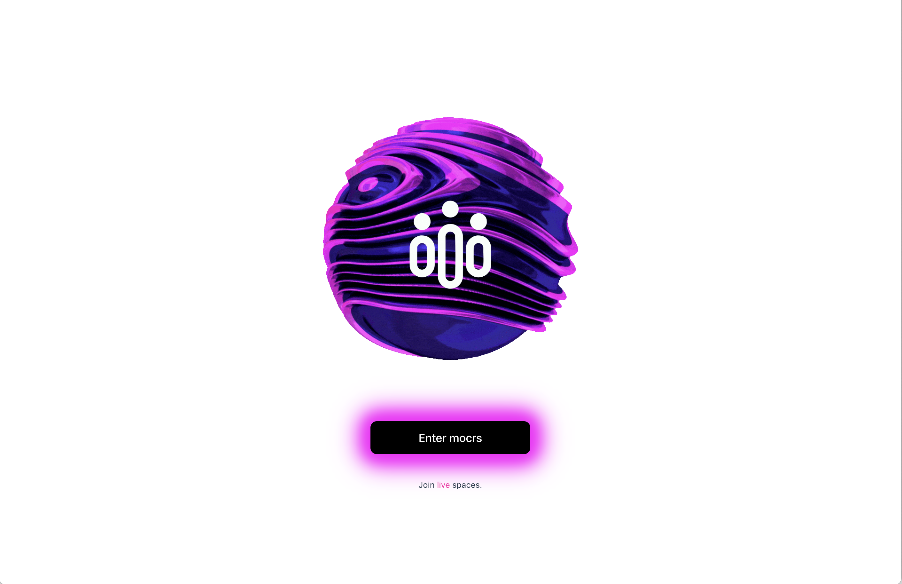
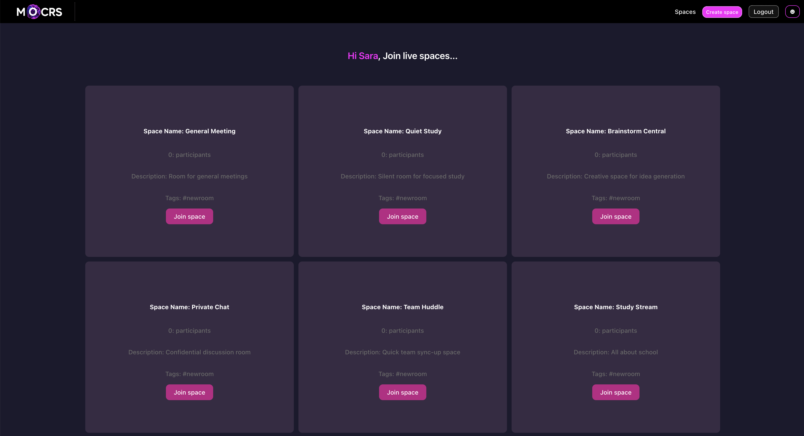
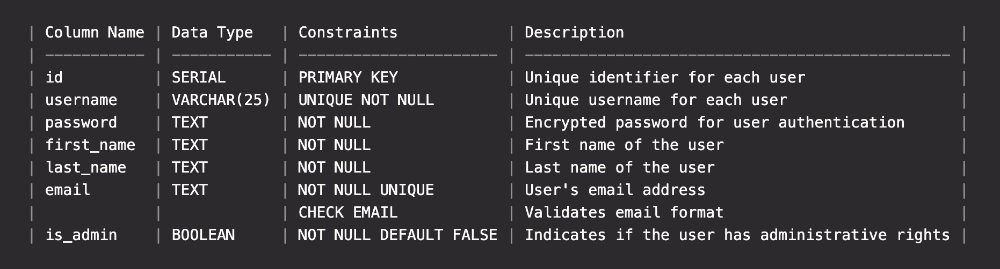
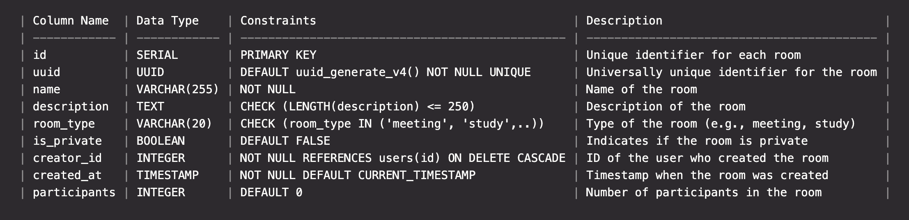
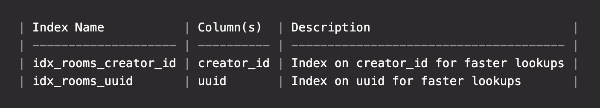
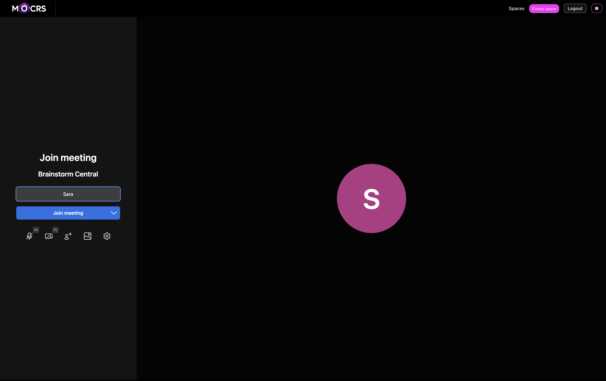

# MOCRs - Massive Open Curiosity Rooms

## 1. Introduction



### 1.1 Project Overview

MOCRs (Massive Open Curiosity Rooms) is an innovative online platform designed to revolutionize learning through collaboration and curiosity. This dynamic platform allows users to engage in MOCRs, where they can explore various topics through real-time discussions facilitated by both human participants and soon - virtual AI talking avatars.

### 1.2 Objectives

- To create a user-friendly web application that facilitates collaborative learning.
- To promote curiosity and lifelong learning among users of all ages and interests.
- To provide a platform where users can easily create, join, and participate in virtual learning rooms.
- To enhance learning experiences through the integration of AI assistants and gamified elements.

## 2. Target Audience

MOCRs are designed for lifelong learners and enthusiasts of all ages, including:

- Students seeking collaborative study environments.
- Hobbyists exploring new interests.
- History buffs, science enthusiasts, and other knowledge seekers.
- Anyone passionate about exploring new topics and engaging in meaningful discussions.

## 3. Features and Functionality



### 3.1 Massive Open Curiosity Rooms (MOCRs)

- **Real-time Discussions**: Users can engage in live discussions on various topics with other participants and AI avatars.
- **AI Assistants**: Virtual AI talking avatars facilitate discussions, provide information, and assist with resource management.
- **Interactive Whiteboards**: Shared whiteboards for brainstorming, note-taking, and collaborative problem-solving.
- **Resource Sharing**: Users can upload and share resources like documents, videos, and links within the rooms.
- **Gamified Elements**: Features like badges, quests, and leaderboards to motivate and reward active participation and knowledge sharing.

### 3.2 User Interaction

- **Room Browsing**: Users can browse live virtual rooms by topic or intention, such as “learn how to use AI,” “silent study together group,” or “meditation group.”
- **Room Creation**: Users can create their own rooms, either private (with controlled access) or public (open to anyone).
- **Customization**: Room creators can customize the room’s features, such as setting discussion rules, enabling/disabling certain tools, and more.

## 4. Minimum Viable Product (MVP)

### 4.1 Core Features

- **Web Application**: A functional web platform accessible via browsers.
- **Live Virtual Rooms**: Users can browse, join, and create virtual rooms.
- **Real-time Interaction**: Live chat and discussion tools within the rooms.
- **Resource Sharing**: Basic functionality for uploading and sharing resources.

## 5. Technologies Used

### 5.1 Frontend

- **Framework**: React
- **Routing**: React Router
- **Real-time Communication**: Jitsi SDK
- **HTTP Client**: Axios
- **Package Manager**: Vite

### 5.2 Backend

- **Framework**: Express.js
- **Database**: PostgreSQL
- **Authentication**: JSON Web Tokens (JWT)
- **Environment Management**: dotenv
- **Miscellaneous**: bcrypt, morgan, cors

## 6. SDKs Used

- **Jitsi React SDK**: For real-time video and audio communication.

## 7. Usage

### 7.1 Running the Application

- Ensure the backend server is running:
  ```bash
  cd backend
  node server.js
  ```
- Ensure the frontend server is running:
  ```bash
  cd frontend
  npm run dev
  ```

### 7.2 Accessing the Application

- Open your browser and navigate to `http://localhost:5173`.

### 7.3 Navigating the Application

- **Home Page**: Browse available rooms or create a new one.
- **Spaces**: Join live spaces by clicking on the space card.
- **Profile**: Manage your user profile and settings.
- **Login/Signup**: Authenticate to access additional features like creating rooms.

## 8. Major Code Files

### 8.1 Frontend

- **AllRoutes.jsx**: Defines the routing for the application.
- **SpaceList.jsx**: Component to list and manage spaces.
- **LiveSpace.jsx**: Component for live space interaction using Jitsi.
- **api.js**: Handles API requests.

### 8.2 Backend

- **app.js**: Main application setup with middleware and routes.
- **routes/roomRoutes.js**: Routes for room-related operations.
- **controllers/roomController.js**: Controllers for room-related logic.
- **middleware/auth.js**: Middleware for authentication.
- **middleware/rateLimiter.js**: Middleware for rate limiting.

## 9. API Documentation

### 9.1 Room Endpoints

- `GET /api/rooms`: Fetch all rooms.
- `POST /api/rooms`: Create a new room.
- `GET /api/rooms/:id`: Fetch a specific room by ID.
- `POST /api/rooms/:id/join`: Join a room.
- `POST /api/rooms/:id/leave`: Leave a room.

### 9.2 User Endpoints

- `POST /api/auth/login`: Authenticate a user.
- `POST /api/auth/register`: Register a new user.
- `GET /api/users/:username`: Fetch user details by username.
- `PATCH /api/users/:username`: Update user details.

### 9.3 Jitsi Token Endpoint

- `POST /api/auth/jtoken`: Create a Jitsi token for a user to join a room.

## 10. Database

### Users Table

**Table Name:** users



### Rooms Table

**Table Name:** rooms



### Indexes



## 11. Setup Instructions

### 11.1 Prerequisites

- Node.js
- npm or yarn
- PostgreSQL

### 11.2 Installation

#### Clone the Repository

```bash
git clone https://github.com/samiesmilz/mocrs.git
cd mocrs
```

#### Backend Setup

1. Navigate to the backend directory:

   ```bash
   cd backend
   ```

2. Install dependencies:

   ```bash
   npm install
   ```

3. Create a `.env` file in the backend directory and add the necessary environment variables:

   ```env
   DATABASE_URL=your_database_url
   JWT_SECRET=your_jwt_secret
   FRONTEND_URL=http://localhost:5173
   ```

4. Run the backend server:
   ```bash
   node server.js
   ```

#### Frontend Setup

1. Navigate to the frontend directory:

   ```bash
   cd frontend
   ```

2. Install dependencies:

   ```bash
   npm install
   ```

3. Create a `.env` file in the frontend directory and add the necessary environment variables:

   ```env
   BACKEND_URL=http://localhost:5001/api
   ```

4. Run the frontend development server:
   ```bash
   npm run dev
   ```

## Home



## 11. Why This Project

MOCRs was created to address the need for more interactive, engaging, and collaborative online learning environments. By integrating real-time discussions, AI assistance, and gamified elements, MOCRs aims to make learning more dynamic and enjoyable, fostering a community of curious minds eager to explore and learn together.

## 12. Contact Information

For support or contributions, please contact:

- **Email**: samie@mocrs.com
- **GitHub**: [MOCRs Repository](https://github.com/samiesmilz/mocrs)


